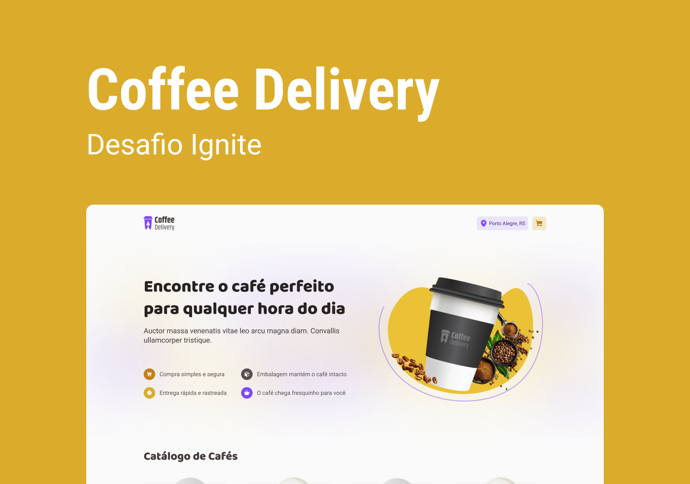

<h1 align="center">
  
</h1>

<span align="center">
  
</span>

## 🧪 Tecnologias

Esse projeto foi desenvolvido com as seguintes tecnologias:

- [Vite](https://vitejs.dev)
- [ReactJS](https://reactjs.org)
- [TypeScript](https://www.typescriptlang.org/)
- [Styled Components](https://styled-components.com)

## 🚀 Como executar

Clone o projeto e acesse a pasta do mesmo.

```bash
$ git clone https://github.com/cybercris/coffee-delivery-react.git
$ cd coffee-delivery-react
```

Para iniciá-lo, siga os passos abaixo:
```bash
# Instalar as dependências
$ npm i
# Iniciar o projeto
$ npm run dev
```

## 💻 Projeto

Esse projeto e uma aplicação para gerenciar um carrinho de compras de uma cafeteria fictícia que tem como funcionalidades listagem dos produtos, adicionar os itens no carrinho, aumentar e remover os itens, exibir o total de itens no carrinho e o valor total da soma de itens.

## 🔖 Layout

Você pode visualizar o layout do projeto através do link abaixo:

- [Layout Web](https://www.figma.com/file/wkfDGRaDq7rysAiVgeaji0/Coffee-Delivery-(Copy)?node-id=11%3A599)
